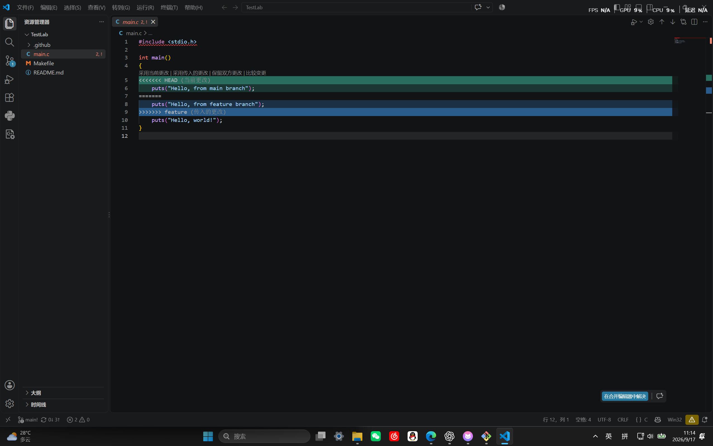
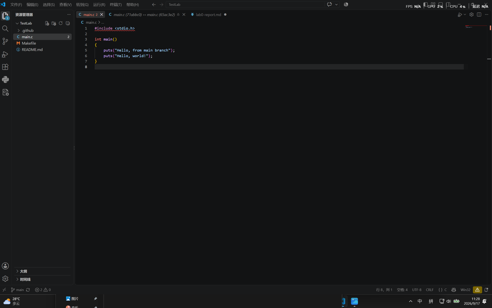
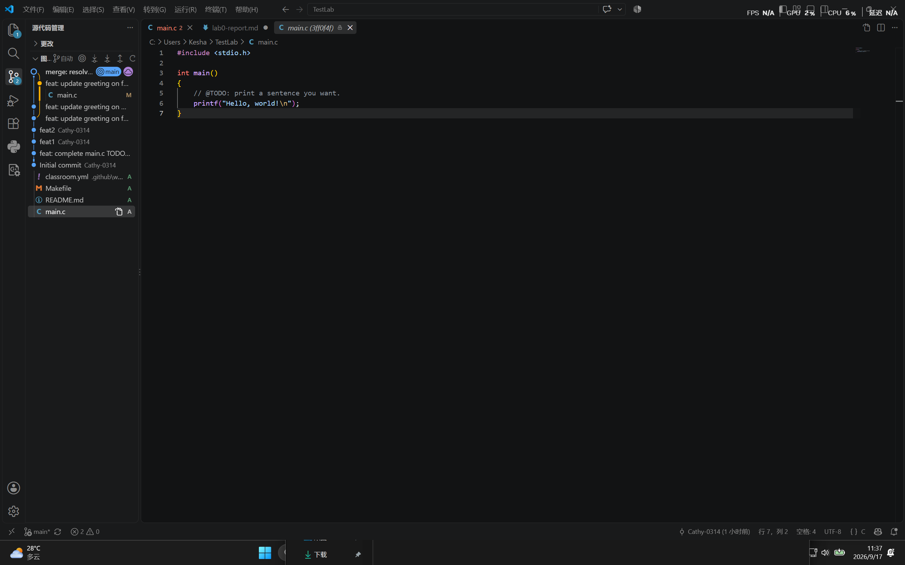

# Lab0 实验报告：Git 基础与分支管理

- 姓名：高诗杰
- 学号：25803050096
- 仓库地址：https://github.com/Cathy-0314/TestLab

## 一、问题

### 1. 你之前有过多人协同开发的经历吗？如果有，你们是使用什么方式分工协作的？

无。

### 2. Git 为什么要设计「暂存（stage）—提交（commit）」两个步骤？

这样可以把「选好这次要提交什么」和「真正记入历史」这两件事分开：

- **让一次提交只包含一件事。** 工作区里可能同时存在修 bug、加功能、调格式的改动。通过暂存区可以挑选其中一部分先提交，另外的留着下次，历史记录因此干净、可读，出问题也容易定位是哪次提交引入的。
- **提交前能预检。** 暂存之后、提交之前，可以用 `git diff --cached` 看清楚「即将写进历史的内容」到底是不是自己想要的，避免误提交调试代码或临时文件。
- **支持细粒度拆分。** `git add -p` 可以在同一个文件里挑选哪些代码块进暂存区，把一次大规模的改动拆成若干条语义清晰的提交。
- **撤销成本低。** 暂存错了用 `git restore --staged` 把文件移出暂存区即可，工作区的代码不受影响；相比之下，提交完再回退就麻烦得多。
- **统一了所有客户端的操作模型。** 命令行、VS Code、IDEA、GUI 工具都实现同一套「暂存—提交」语义，换个工具不用重新适应。


### 3. `git branch` 和 `git branch -a` 的区别是什么？

- `git branch`：只列出**本地分支**，当前所在的分支前面带 `*`。
- `git branch -a`（等价于 `--all`）：列出本地分支**加上远程跟踪分支**，远程分支形如 `remotes/origin/main`。
- 远程跟踪分支是本地保存的、对远程状态的只读快照，只有执行 `fetch` / `pull` / `push` 时才会更新，它本身不能直接提交修改。如果直接切到远程分支上，会进入 detached HEAD 状态。
- 另外还有 `git branch -r`，只列远程分支，不列本地的。

## 二、阅读笔记

### 选读一：Commit Message 规范

提交信息约定为 `type(scope): subject` 三段式。`type` 用来说明提交性质，常用取值有 `feat`（新功能）、`fix`（修 bug）、`docs`（文档）、`style`（格式，不影响逻辑）、`refactor`（重构）、`test`（测试）、`chore`（构建、依赖等杂项）。标题一行讲清做了什么，一般不超过 50 个字符；如果需要解释「为什么改」以及和旧行为的差异，写在正文里；涉及关闭 Issue 或破坏性变更，写进尾部。这样规范的价值在于：历史可读、方便 code review，也能据此自动生成变更日志。

### 选读二：语义化版本

版本号采用 `MAJOR.MINOR.PATCH` 三段。做了不向下兼容的改动就升 `MAJOR`，向下兼容地新增功能升 `MINOR`，修 bug 升 `PATCH`。`0.y.z` 表示仍在开发阶段，接口随时可能变。预发布版本在版本号后加 `-alpha.1`、`-beta.2` 之类的标识。它的意义是让使用方仅凭版本号就能判断升级的风险：`1.4.2 → 1.5.0` 可以放心升，`1.4.2 → 2.0.0` 就得先看有没有破坏性变更。

### 我对「为什么要学习 Git」的理解

代码要有可回溯的历史（改坏了能回退）、多人协作必须有个统一的合并机制、这门课后续所有 Lab 都要用它交作业、是找工作后团队协作的基本要求。

## 三、实验步骤

1. **配置身份与密钥**：设置 `git config --global user.name` 和 `user.email`；用 `ssh-keygen -t ed25519` 生成密钥对，把公钥添加到 GitHub 的 SSH keys，用 `ssh -T git@github.com` 验证通过。
2. **建立并克隆仓库**：从课程模板仓库 `ICS-26Fall-FDU/GitLab` 创建个人仓库，用 SSH 方式克隆到本地（`git clone git@github.com:Cathy-0314/TestLab.git`）。
3. **完成 TODO**：修改 `main.c` 中打印的句子并提交，提交号为 `49b1ebb`。
4. **分支练习**：
   - `git switch -c feature` 新建分支，修改 `main.c` 中打印的语句后提交，提交号为 `65ac3e2`；
   - 切回 `main` 分支，对同一行做不同的修改并提交，提交号为 `2469c18`；
   - 执行 `git merge feature`，出现 `CONFLICT (content): Merge conflict in main.c`；
   - 手动解决冲突：删去 `<<<<<<<`、`=======`、`>>>>>>>` 三行标记，保留最终版本，`git add main.c` 后提交，提交号为 `3b88b59`。
5. **推送**：执行 `git push origin main` 和 `git push origin feature`，本地与远程同步。
6. 在 `main` 分支添加本实验报告并提交。

最终提交历史：

```
*   3b88b59 (main) merge: resolve conflict in main.c
|\
| * 65ac3e2 (feature) feat: update greeting on feature
* | 2469c18 feat: update greeting on main
|/
* 71abbc0 feat: update greeting on feature
* 14d901b feat2
* 6988e71 feat1
* 49b1ebb feat: complete main.c TODO
* 3ff0f4f Initial commit
```






## 四、实验中遇到的问题与解决

1. **`fatal: not a git repository`**：在错误的目录下执行 Git 命令。Git 只认当前目录及其父目录，用 `pwd` 确认位置、`cd` 进入仓库目录后正常。
2. **`Your local changes would be overwritten by checkout`**：当前文件未提交就切换分支，且该文件在两个分支里内容不同。先 `git commit` 落盘改动，再切换分支。
3. **第一次合并没有冲突**：`main` 分支没有新提交，`git merge` 走了 fast-forward，直接移动指针。解决方法是让两个分支从同一个起点出发、各自修改**同一行**并分别提交，这样合并时才会产生冲突。
